# SeaweedFS Browser

<p align="center">
  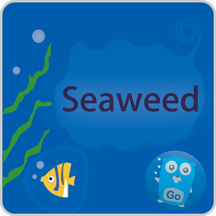
</p>

<p align="center">
  基于 PySide6 的 SeaweedFS Filer 桌面客户端，支持目录浏览、上传、下载、后台预览、
  统一任务中心和中英法三语界面。
</p>

<p align="center">
  Windows
  · Python 3.12
  · PySide6
  · Nuitka
  · Qt Quick 3D
</p>

当前版本：`1.0.14`

## 目录

- [下载与运行](#下载与运行)
- [主要能力](#主要能力)
- [快速使用](#快速使用)
- [总体架构](#总体架构)
- [异步任务架构](#异步任务架构)
- [状态与进度展示](#状态与进度展示)
- [窗口关系与预览流程](#窗口关系与预览流程)
- [多语言实现](#多语言实现)
- [数据访问、缓存与安全边界](#数据访问缓存与安全边界)
- [项目结构](#项目结构)
- [如何扩展项目](#如何扩展项目)
- [配置](#配置)
- [开发、测试与发布](#开发测试与发布)

## 下载与运行

### Windows 用户

请从 [Releases](https://github.com/cossoledad/RESTFulSeaweedFSBrowser/releases)
下载名称类似下面的独立运行包：

```text
SeaweedFSBrowser-v<版本>-windows-x64-standalone.zip
```

解压后直接运行 `SeaweedFSBrowser.exe`。发布包已经包含 Python、PySide6 和 Qt Quick 3D 模型预览环境。

> [!IMPORTANT]
> 仓库首页的 `Code → Download ZIP` 和 Release 中自动生成的 `Source code`
> 仅包含源代码，不包含可直接运行的打包环境。

### 从源码运行

```powershell
python -m pip install -r requirements-ci.txt
python main.py
```

## 主要能力

| 类别 | 能力 |
| --- | --- |
| 浏览 | 分页读取目录、进入文件夹、返回上级、当前页搜索、九列元数据展示和按原始值排序 |
| 缓存 | 最多缓存 32 个最近目录；普通导航优先使用缓存，`F5` 强制刷新 |
| 写入 | 新建远程文件夹；批量选择本地文件上传；同名文件确认后覆盖 |
| 下载 | 单文件原子保存；递归保存目录；默认 4 路并发下载 |
| 预览 | 文本、图片、GLB、GLTF；GLTF 会同时下载其本地相对资源 |
| 交互 | 文本、图片、详细信息均为非模态窗口，预览保持打开时主窗口仍可操作 |
| 后台任务 | 目录加载、创建目录、上传、下载、递归下载和预览统一进入任务中心 |
| 任务反馈 | 状态栏摘要、确定/不确定进度、失败信息、取消操作、最近 50 条历史 |
| 多语言 | 简体中文、English、Français；运行时即时切换并持久化 |
| 发布 | GitHub Actions 执行测试、Nuitka Windows 打包、归档和 Release 发布 |

## 快速使用

1. 输入 SeaweedFS Filer 的 `Base URL`，例如
   `http://10.1.23.81:38888`。
2. 输入允许浏览的根目录，例如 `/buckets/cax-dev/files/`。
3. 点击“加载根目录”。
4. 双击文件夹进入目录，双击文件打开对应预览。
5. 使用“新建文件夹”“上传文件”或“保存到本地”执行写入和下载。
6. 点击状态栏右侧的“任务”打开任务中心，查看进度、错误或取消任务。

## 总体架构

项目采用“界面编排、任务运行时、业务 Worker、传输与工具层”分离的结构。
`MainWindow` 不执行耗时 I/O；它负责收集用户意图、创建任务、接收业务结果并更新界面。

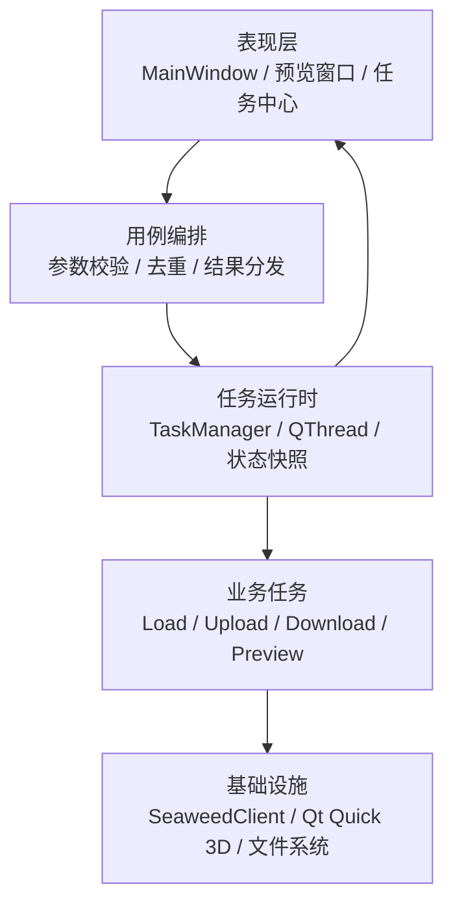

### 各层职责

| 层 | 主要文件 | 职责 | 不应承担的职责 |
| --- | --- | --- | --- |
| 表现层 | `main.py`、`widgets.py`、`task_widgets.py` | 窗口、控件、用户操作和结果展示 | 阻塞式网络或磁盘 I/O |
| 用例编排 | `MainWindow` | 参数验证、任务构造、去重键、缓存失效、结果路由 | 具体 HTTP 传输 |
| 任务模型 | `task_models.py` | 任务类型、状态、进度、错误、只读快照 | Qt 线程管理 |
| 任务运行时 | `task_runtime.py` | 创建/回收线程、取消、并发上限、历史记录、信号转发 | 业务规则 |
| 业务 Worker | `tasks.py` | 在后台线程执行一个完整业务任务并报告进度 | 直接修改 UI |
| 批量调度 | `uploads.py`、`downloads.py` | 有界线程池、批次推进、聚合进度、部分失败 | Qt 控件操作 |
| 数据访问 | `client.py` | SeaweedFS HTTP、流式上传、分页、原子下载 | 窗口状态 |
| 领域工具 | `core.py`、`model_files.py`、`cache.py` | 配置、路径安全、模型资源解析、LRU 缓存 | 用例编排 |
| 本地化 | `i18n.py` | 语言规范化、翻译目录、中文回退和格式化 | 控件生命周期 |

这一分层保证了网络、批量并发、任务状态和 UI 可以分别测试，也让新增功能能复用同一套
异步生命周期。

## 异步任务架构

### 核心对象

| 对象 | 作用 |
| --- | --- |
| `TaskSpec` | 启动前的任务说明：类型、标题、详情、是否可取消、去重键、优先级和元数据 |
| `TaskProgress` | 当前进度：模式、主进度、单位、阶段、详情和可选的次级进度 |
| `TaskError` | 用户可见错误、详细信息、是否可重试；临时业务载荷不会写入历史快照 |
| `TaskSnapshot` | 不可变任务快照，保存状态、时间、进度和精简后的错误 |
| `CancellableWorker` | 所有后台业务 Worker 的基类，统一四类信号和取消令牌 |
| `ManagedTask` | 运行时对象，持有快照、`QThread`、Worker 和生命周期 Relay |
| `TaskManager` | 任务注册中心，负责启动、状态迁移、取消、清理、并发限制和历史 |

所有 Worker 都使用相同信号协议：

```python
progress_changed = Signal(object)
succeeded = Signal(object)
failed = Signal(object)
cancelled = Signal()
```

Worker 只产生业务结果和任务事件，不直接操作 Qt 控件。Qt 的跨线程信号会把事件送回
主线程，再由 `MainWindow` 和任务展示组件消费。

### 一次任务如何执行

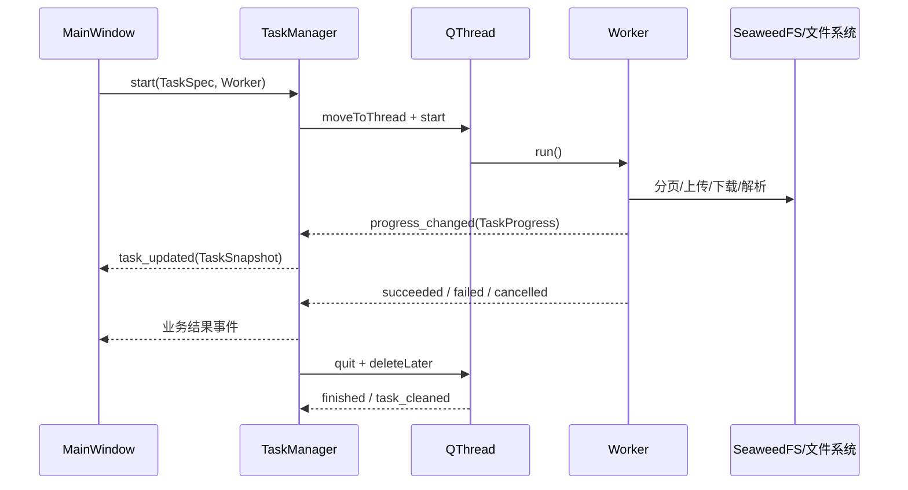

`TaskManager.start()` 的关键顺序是：

1. 检查 `dedup_key`，阻止同一业务任务重复启动。
2. 检查对应 `TaskKind` 的并发上限。
3. 创建 `QUEUED` 快照、`QThread` 和 `TaskLifecycleRelay`。
4. 将 Worker 移入后台线程并连接四类业务信号。
5. 将任务标记为 `RUNNING` 并启动线程，随后执行 `worker.run()`。
6. 终态信号先更新快照并转发业务结果，再要求线程退出。
7. 线程结束后释放 Worker、Relay 和线程对象，保留精简历史快照。

### 任务状态机

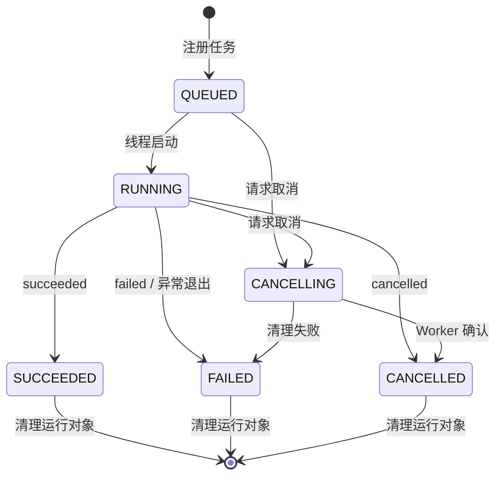

活动状态为 `QUEUED / RUNNING / CANCELLING`，终态为
`SUCCEEDED / FAILED / CANCELLED`。快照使用不可变 `dataclass`，状态变化通过
`replace()` 生成新快照，避免展示层观察到半更新状态。

### 当前任务类型与并发策略

| `TaskKind` | Worker | 默认并发上限 | 说明 |
| --- | --- | ---: | --- |
| `DIRECTORY_LOAD` | `DirectoryLoadWorker` | 1 | 分页加载当前目录 |
| `DIRECTORY_CREATE` | `CreateDirectoryWorker` | 1 | 在当前远程目录创建文件夹 |
| `FILE_UPLOAD` | `UploadBatchWorker` | 1 个批次 | 批次内部默认 3 路上传 |
| `FILE_DOWNLOAD` | `FileDownloadWorker` | 3 | 独立保存多个文件 |
| `DIRECTORY_DOWNLOAD` | `SaveDirectoryWorker` | 1 | 扫描目录后默认 4 路下载 |
| `PREVIEW_LOAD` | `PreviewLoadWorker` | 3 | 后台准备文本、图片或模型 |

这里有两级并发：

- `TaskManager` 控制 UI 级任务数量，防止无限创建 `QThread`。
- 上传和递归下载 Worker 内部使用有界 `ThreadPoolExecutor`，提高批量小文件吞吐。

批量调度只保持有限数量的 in-flight Future；发生取消或关键失败时设置停止事件、
取消未开始的 Future，并等待已运行任务安全退出。

### 取消与退出

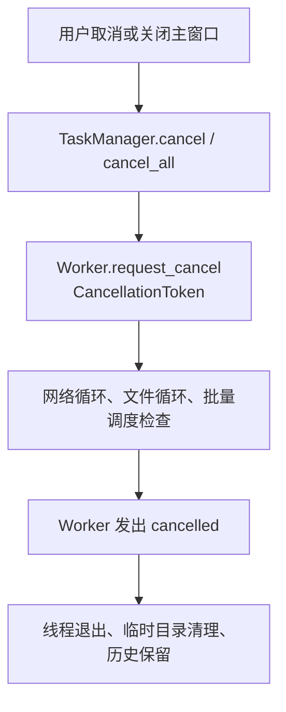

- `CancellationToken` 基于 `threading.Event`，可安全跨线程读取。
- 流式上传、下载、分页扫描和模型资源下载都会在循环中检查取消状态。
- 主窗口关闭时如果仍有活动任务，会先禁用界面、取消全部任务并忽略本次关闭事件。
- `all_finished` 到达后再次关闭，随后终止仍存活的模型预览子进程并清理临时目录。

## 状态与进度展示

### 进度模型

`TaskProgress` 同时支持确定进度和不确定进度：

| 字段 | 含义 | 示例 |
| --- | --- | --- |
| `mode` | `DETERMINATE` 或 `INDETERMINATE` | 已知文件大小时为确定进度 |
| `current / total` | 主进度 | 已上传字节 / 总字节 |
| `unit` | `BYTES / ITEMS / ENTRIES / STEPS / NONE` | 上传用字节，目录保存用文件数 |
| `phase` | 当前阶段 | “下载模型”“分析 GLTF 资源” |
| `detail` | 当前对象 | 文件名、目录名或资源相对路径 |
| `secondary_*` | 次级进度 | 上传字节进度之外的已完成文件数 |

上传和单文件下载的高频进度事件最多约每 100 ms 发出一次，既保持反馈及时，也避免
大量信号让 UI 主线程忙于重绘。

### 一个状态源，两个展示出口

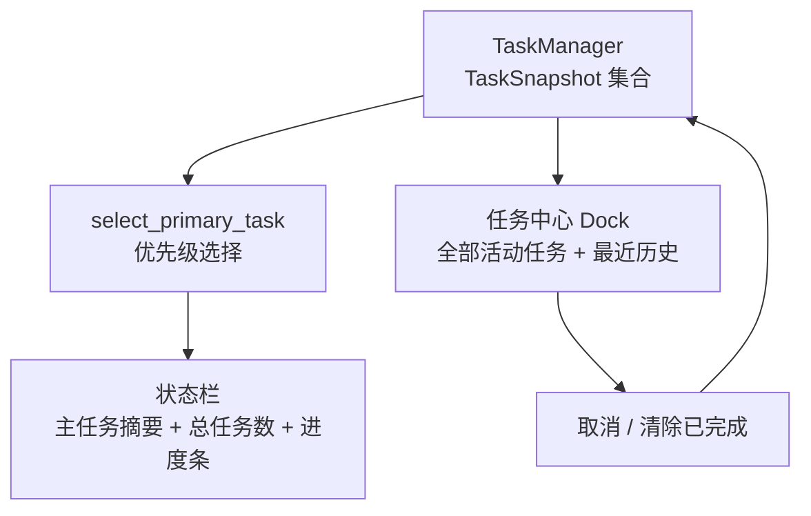

`TaskStatusController` 从全部活动任务中选一个主任务显示。默认优先级依次为上传、
单文件下载、目录下载、目录加载、预览加载、创建目录，也可通过 `TaskSpec.priority`
覆盖。

任务中心显示任务、状态、进度、详情和操作：

- 活动任务排在历史任务之前。
- 可取消的活动任务显示“取消”按钮。
- 失败任务显示精简错误，详细错误放在提示信息中。
- 最近保留 50 个终态快照。
- 成功结果和失败重试载荷只通过即时信号传递，不保存在历史快照中，避免长期持有
  大列表、文件内容或其他业务对象。

## 窗口关系与预览流程

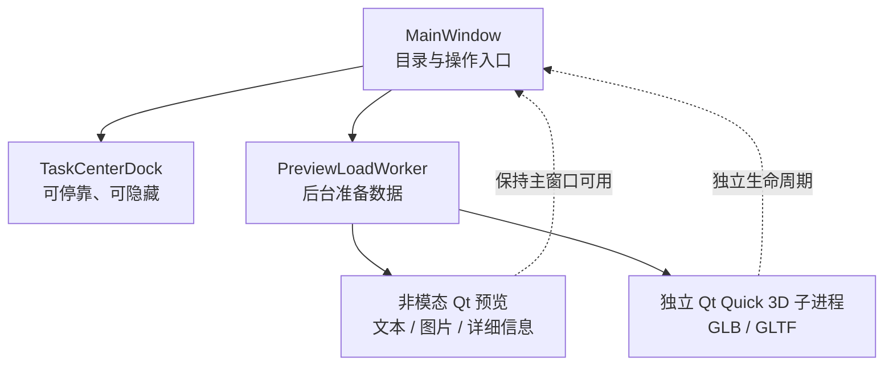

### 为什么预览不会阻塞主窗口

- 文本、图片和详细信息使用 `Qt.WindowModality.NonModal`，通过 `show()` 打开，
  不进入嵌套的模态事件循环。
- `_preview_windows` 持有窗口引用，避免窗口被 Python 垃圾回收。
- 预览键由“预览类型 + 服务地址 + 远程路径”组成；相同预览再次打开时只恢复并激活
  已有窗口。
- 窗口设置 `WA_DeleteOnClose`，销毁时自动从注册表移除。
- 图片和模型先下载到独立临时目录。图片窗口关闭、模型子进程退出或应用关闭时清理。

### 模型预览

模型预览分为“后台准备”和“独立显示”两段：

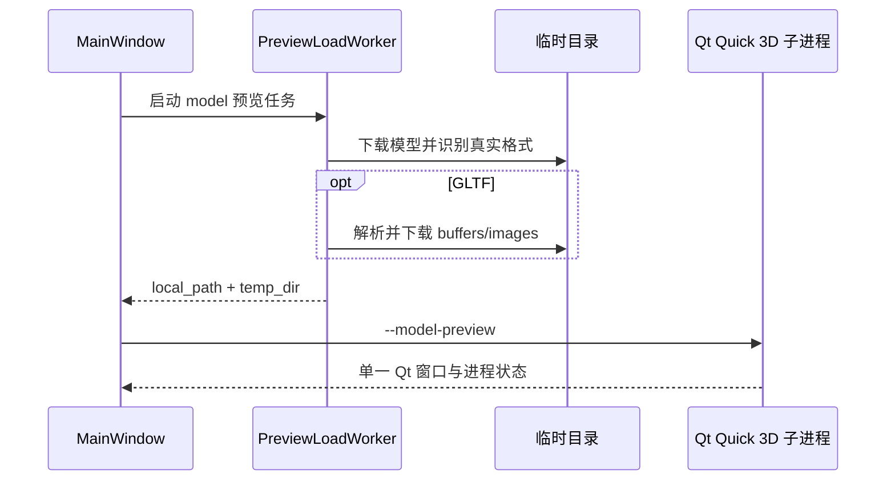

- 通过文件头识别 GLB/GLTF，而不是只相信扩展名。
- GLTF 的相对 `buffers` 和 `images` 会按原目录结构下载。
- `data:` URI 和外部 URL 不重复下载。
- 所有相对资源都经过本地路径边界校验，阻止 `../` 逃逸。
- 主进程每秒回收已结束的模型预览进程；退出时统一终止剩余进程。

普通输入框、确认框、文件选择器仍可使用短生命周期模态对话框，因为它们只收集一次
用户决定；长时间存在的内容窗口一律采用非模态设计。

## 多语言实现

当前语言代码：

| 代码 | 显示名称 | 行为 |
| --- | --- | --- |
| `zh_CN` | 简体中文 | 默认语言，也是缺失翻译的回退文本 |
| `en` | English | 英文目录 |
| `fr` | Français | 法文目录 |

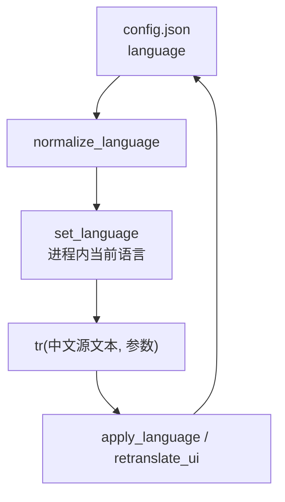

### 翻译策略

项目没有把控件文案散落成三套资源文件，而是把稳定的中文源文本作为键：

```python
self.create_dir_btn.setText(tr("新建文件夹"))
self.label.setText(
    tr("{count} 个后台任务 · {summary}", count=len(active), summary=summary)
)
```

`tr()` 根据当前语言查找英文或法文目录；查不到时直接返回中文源文本。占位符在翻译后
统一使用命名参数格式化，因此三种语言可以调整语序。

### 即时切换流程

1. 语言菜单调用 `change_language()`。
2. `normalize_language()` 将 `zh-* / en-* / fr-*` 归一化为受支持代码。
3. 新语言写入 `AppConfig` 并原子保存到 `config.json`。
4. `MainWindow.apply_language()` 更新主窗口、菜单、按钮、表头和当前路径。
5. `TaskCenterDock.retranslate_ui()` 重建任务中心文案。
6. `TaskStatusController.retranslate_ui()` 刷新状态栏。
7. 当前目录条目重新渲染，使“文件/文件夹”等动态文本同步变化。

测试会扫描所有字面量 `tr("...")` 调用，确保英文和法文目录包含相同键和相同命名
占位符，并检查未包装的用户可见中文文本。

## 数据访问、缓存与安全边界

### SeaweedFS 数据流

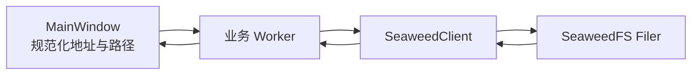

`SeaweedClient` 集中处理：

- URL 路径编码和 HTTP/HTTPS 连接。
- SeaweedFS Filer 分页游标与最大分页次数保护。
- `POST <path>/` 创建目录。
- `PUT <path>` 流式覆盖上传，不把整个文件读入内存。
- 上传前后检查本地文件大小和修改时间，并在服务器返回 MD5 时校验。
- 下载到唯一 `.part-*` 临时文件，完成 `fsync` 后使用 `os.replace()` 原子替换。
- 失败或取消时删除临时文件，不破坏已有目标文件。

### 缓存与一致性

- 目录缓存是容量受限的 `LruCache`，默认最多 32 项。
- 缓存键包含服务地址和规范化目录路径，避免不同服务之间串数据。
- 新建目录、上传以及状态不确定的取消/失败会使对应目录缓存失效。
- 如果目录正在加载时发生写入，刷新请求进入待处理集合，线程清理后再重新加载。
- `F5` 明确绕过缓存，普通目录导航优先复用缓存。

### 路径与资源保护

- 所有远程子名称拒绝空值、`.`、`..`、路径分隔符和控制字符。
- 写入前确认当前目录仍位于配置根目录内。
- 递归下载验证服务端返回路径属于源目录。
- 本地落盘使用 `safe_local_path()`，防止路径穿越和符号链接逃逸。
- 配置中的并发数和缓存容量有硬上限，错误配置不会无限消耗线程或内存。

## 项目结构

| 路径 | 作用 |
| --- | --- |
| `main.py` | 应用入口、主窗口、用例编排、结果路由、模型预览子进程入口 |
| `seaweed_browser/core.py` | 版本、配置、路径校验、URL、格式化规则 |
| `seaweed_browser/i18n.py` | 语言状态、中文回退、英文和法文翻译目录 |
| `seaweed_browser/client.py` | SeaweedFS HTTP、分页、流式上传和原子下载 |
| `seaweed_browser/task_models.py` | 任务类型、状态、进度、错误和快照 |
| `seaweed_browser/task_runtime.py` | `QThread` 生命周期、取消、去重、并发限制和历史 |
| `seaweed_browser/tasks.py` | 目录、上传、下载和预览 Worker |
| `seaweed_browser/task_presenter.py` | 状态与进度格式化、状态栏控制器 |
| `seaweed_browser/task_widgets.py` | 可停靠任务中心 |
| `seaweed_browser/uploads.py` | 上传计划、固定并发调度和部分失败汇总 |
| `seaweed_browser/downloads.py` | 固定并发递归下载调度 |
| `seaweed_browser/model_files.py` | GLB/GLTF 识别及 GLTF 外部资源解析 |
| `seaweed_browser/widgets.py` | 可排序条目、文本/图片/详细信息预览控件 |
| `seaweed_browser/cache.py` | 有界 LRU 目录缓存 |
| `seaweed_browser/cancellation.py` | 线程安全取消令牌 |
| `seaweed_browser/resources.py` | 开发与 Nuitka 环境下的资源路径 |
| `tests/` | 核心、网络、并发、任务、i18n 和发布契约测试 |
| `build.ps1` | Nuitka standalone/onefile 构建与 Qt 资源打包 |
| `.github/workflows/ci.yml` | Linux 语法/单测、Windows PySide6 测试和 Nuitka 发布流程 |
| `release-notes/` | 按版本保存的 Release 说明 |

## 如何扩展项目

### 新增一个异步任务

下面以“删除远程文件”为例说明完整接入点。实际实现时仍应根据 SeaweedFS Filer API
补充确认、错误处理和缓存失效策略。

#### 1. 增加任务类型

在 `task_models.py` 增加枚举，并按用户感知的重要程度配置默认优先级：

```python
class TaskKind(Enum):
    # ...
    FILE_DELETE = "file_delete"


TASK_KIND_PRIORITY = {
    # ...
    TaskKind.FILE_DELETE: 65,
}
```

如果只是现有任务类型的另一种业务参数，可以复用已有 `TaskKind`，不必为了每个按钮
都增加枚举。

#### 2. 在数据访问层增加同步原语

在 `SeaweedClient` 中实现可取消、与 UI 无关的同步方法：

```python
def delete_file(self, base_url, full_path, cancel_check=None):
    ensure_not_cancelled(cancel_check)
    # 发送 DELETE，请求结束前后继续检查 cancel_check
```

数据访问方法应该抛出业务可识别异常，不应弹出对话框或引用窗口。

#### 3. 实现 Worker

在 `tasks.py` 继承 `CancellableWorker`，保证每条执行路径只发出一个终态信号：

```python
class FileDeleteWorker(CancellableWorker):
    def __init__(self, client, base_url, full_path):
        super().__init__()
        self.client = client
        self.base_url = base_url
        self.full_path = full_path

    def run(self) -> None:
        try:
            self.progress_changed.emit(
                TaskProgress.indeterminate(tr("删除文件"), basename(self.full_path))
            )
            result = self.client.delete_file(
                self.base_url,
                self.full_path,
                cancel_check=self.is_cancelled,
            )
            self.succeeded.emit(result)
        except OperationCancelled:
            self.cancelled.emit()
        except Exception as error:
            self.failed.emit(
                TaskError(format_worker_error(tr("删除失败"), error))
            )
```

耗时循环必须定期调用 `is_cancelled()` 或 `token.raise_if_cancelled()`。Worker
不得直接读取或修改 Qt 控件。

#### 4. 注册并启动任务

在 `MainWindow` 初始化 `TaskManager` 时设置该类型的并发限制，然后从用户操作入口创建
稳定的去重键：

```python
worker = FileDeleteWorker(self.client, base_url, full_path)
task_id = self._task_manager.start(
    TaskSpec(
        kind=TaskKind.FILE_DELETE,
        title=tr("删除文件：{name}", name=basename(full_path)),
        detail=full_path,
        dedup_key=f"file-delete:{base_url}:{full_path}",
    ),
    worker,
)
```

去重键应描述任务的实际副作用边界。会写入不同目标的任务不能误用同一个固定键。

#### 5. 路由业务结果

根据任务是一对一任务、可并发任务还是按业务键索引的任务，选择保存单个 `task_id`、
集合或映射。随后在以下四个入口处理：

- `on_task_succeeded()`：消费结果、使缓存失效、刷新 UI。
- `on_task_failed()`：展示错误或保存可重试载荷。
- `on_task_cancelled()`：处理远程状态不确定性。
- `on_task_cleaned()`：清除本地任务引用并触发延迟操作。

不要把清理逻辑只放在成功路径；线程对象释放完成以 `task_cleaned` 为准。

#### 6. 接入多语言

所有用户可见文本使用稳定的中文源文本调用 `tr()`，然后在 `_EN` 和 `_FR` 中加入
完全相同的键。命名占位符必须一致：

```python
tr("删除文件：{name}", name=file_name)
```

如果新增了长期存在的控件，还要在所属组件的 `retranslate_ui()` 或
`MainWindow.apply_language()` 中更新它。

#### 7. 添加测试

至少覆盖：

- `SeaweedClient` 的请求方法、取消和错误响应。
- Worker 的成功、失败、取消以及进度事件。
- `TaskManager` 状态迁移、并发上限、去重和线程回收。
- 新增翻译键和占位符一致性。
- 写操作完成、失败或取消后的缓存失效。

### 新增一种预览类型

1. 在 `open_preview()` 中根据扩展名选择新的 `preview_type`。
2. 在 `PreviewLoadWorker.run()` 中后台下载和准备数据。
3. 在 `on_preview_load_finished()` 中只进行快速的 UI 构造。
4. 用 `show_preview_window()` 注册非模态窗口，复用去重、激活和销毁清理。
5. 如果使用外部进程，仿照模型预览保存进程与临时目录，并在定时回收和退出路径清理。
6. 为新类型设置合理的临时文件、大小和并发限制。

### 新增一种语言

1. 在 `LANGUAGE_NAMES` 添加语言代码和本地名称。
2. 新建该语言翻译字典并加入 `_TRANSLATIONS`。
3. 扩展 `normalize_language()` 的区域代码归一化规则。
4. 确保新目录与中文源键完全一致，命名占位符集合也一致。
5. 更新 README 的语言表并运行 i18n 测试。

## 配置

Windows 默认配置位置：

```text
%APPDATA%/SeaweedFSBrowser/config.json
```

非 Windows 环境使用：

```text
~/.config/SeaweedFSBrowser/config.json
```

示例：

```json
{
  "language": "zh_CN",
  "base_url": "http://10.1.23.81:38888",
  "root_dir": "/buckets/cax-dev/files/",
  "page_limit": 1000,
  "directory_cache_max_entries": 32,
  "directory_download_workers": 4,
  "upload_workers": 3,
  "max_concurrent_preview_loads": 3,
  "max_concurrent_file_saves": 3
}
```

配置通过同目录临时文件写入、`fsync` 后原子替换。读取失败时回退到安全默认值。

| 配置项 | 默认值 | 硬上限 | 说明 |
| --- | ---: | ---: | --- |
| `page_limit` | 1000 | — | SeaweedFS 单页条目数 |
| `directory_cache_max_entries` | 32 | 256 | 目录缓存数量 |
| `directory_download_workers` | 4 | 16 | 递归下载线程数 |
| `upload_workers` | 3 | 16 | 批量上传线程数 |
| `max_concurrent_preview_loads` | 3 | 16 | 同时准备的预览任务 |
| `max_concurrent_file_saves` | 3 | 16 | 同时保存的单文件任务 |

## 开发、测试与发布

### 运行测试

```powershell
python -m py_compile main.py seaweed_browser/*.py tests/*.py
python -m unittest discover -s tests -v
```

测试覆盖配置与路径、缓存、HTTP 客户端、上传下载并发、模型资源、任务模型、
Qt 任务生命周期、翻译目录和发布契约。

### Nuitka 构建

Standalone（默认）：

```powershell
.\build.ps1
```

Onefile：

```powershell
.\build.ps1 -Mode onefile
```

构建脚本通过 PySide6 插件打包 Qt Quick 3D 运行模块，并将 `resource/model_preview.qml` 随应用发布。

### 日志与模型预览排障

- 主程序日志位于 `%APPDATA%/SeaweedFSBrowser/logs/application.log`。
- 每次模型预览会创建独立的 `model-preview-*.log`，其中包含 Qt、QML、
  RuntimeLoader 和 Python 异常信息。
- 模型加载失败或预览进程异常退出时，界面会显示具体错误或对应日志文件路径。
- Windows 发布包会包含全部 Qt 插件，以确保 Qt Quick 3D 的 GLB/GLTF importer
  不会在 Nuitka 打包时被遗漏。

### CI 与 Release

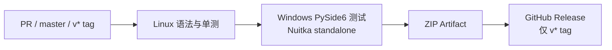

- PR 和 `master` push：执行检查、测试、Windows 构建并上传 CI Artifact。
- `v*` tag：额外校验 tag 与 `APP_VERSION` 一致，再创建 GitHub Release。
- 每次发布前在 `release-notes/` 新增对应文件，例如
  `release-notes/v1.0.14.md`。

## 设计原则

- 主线程只做快速 UI 工作，所有长时间 I/O 都进入统一任务系统。
- 任务状态与业务结果分离：状态可长期保存，业务大对象只即时传递。
- 并发必须有上限，取消必须协作式传播，退出必须等待资源回收。
- 长时间存在的内容窗口保持非模态，主窗口始终可继续浏览和管理任务。
- 远端路径、本地路径、临时文件和配置写入都必须守住明确的安全边界。
- 用户可见文本统一走 `tr()`，中文是稳定源文本和最终回退。
- 新功能优先复用现有 Task、Worker、Client 和展示协议，避免在窗口类中重新实现线程。
